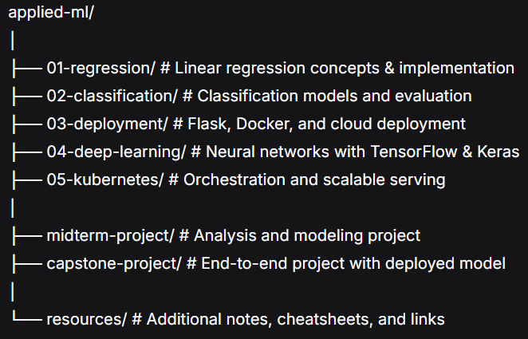

# Applied Machine Learning: From Theory to Production

This repository documents my comprehensive journey through a project-based machine learning cohort. This intensive program was designed to bridge the gap between theoretical concepts and production-ready systems, providing a complete foundation in both data science and machine learning engineering.

## Overview
This hands-on curriculum was structured to mirror the real-world lifecycle of a machine learning project. The learning philosophy was built on a dual approach for every concept: **first understand the underlying theory and then solidify that knowledge through practical implementation and deployment.**

The ultimate goal was to transition from building models in a notebook to building reliable, scalable machine learning services.

## Curriculum & Skills Acquired
The course was divided into two integrated parts, carefully designed to build both theoretical knowledge and practical skills.

### **Part 1: Machine Learning Foundations**
Focused on mastering core machine learning concepts and their implementation using Python.

**Core Concepts & Algorithms:**
- **Linear Regression:** Feature engineering, handling categorical variables, and regularization techniques (Ridge/Lasso).
- **Classification:** Logistic regression, model evaluation metrics (precision, recall, ROC-AUC), and feature importance analysis.
- **Ensemble Methods:** Decision Trees, Random Forests, and Gradient Boosting (XGBoost).
- **Neural Networks & Deep Learning:** Building and training models with TensorFlow and Keras, including Convolutional Neural Networks (CNNs) and transfer learning.

**Tools & Libraries:**
- `Python`, `Jupyter Notebooks`
- `NumPy`, `Pandas` for data manipulation and analysis
- `Matplotlib`, `Seaborn` for data visualization
- `Scikit-Learn` for classical machine learning algorithms
- `TensorFlow`, `Keras` for deep learning

### **Part 2: Production Deployment (MLOps)**

Focused on the engineering required to take models from a development environment to a production system.

**Deployment & Orchestration:**
- **Web Services:** Building RESTful APIs for model serving using **Flask**.
- **Containerization:** Packaging models and their environments into reproducible units using **Docker**.
- **Serverless Deployment:** Deploying models as serverless functions using **AWS Lambda**.
- **Scalable Infrastructure:** Introduction to orchestrating containerized applications with **Kubernetes** and high-performance serving with **TensorFlow Serving**.

## Learning Methodology

The cohort emphasized a rigorous, hands-on approach:
- **Theory First:** Each topic began with a deep dive into the intuition and mathematics behind the algorithm.
- **Code Second:** Theoretical understanding was immediately solidified by implementing algorithms from scratch and using industry-standard libraries.
- **Project-Based:** Learning was driven by continuous hands-on projects and homework assignments.
- **Public Learning:** Documenting and sharing the learning journey to reinforce knowledge and build a portfolio.

## Portfolio Projects

The culmination of this learning path was the development of end-to-end machine learning projects.

- **Midterm Project:** A machine learning project focusing on robust data analysis, model training, and evaluation.
- **Capstone Project:** A comprehensive project tackling a real-world problem, from initial data collection and cleaning to model training, evaluation, and **deployment as a live web service.**

*Example Project Ideas: Predictive modeling, image classification, or NLP tasks deployed with a Flask API and containerized with Docker.*

## Technologies & Tools

This journey provided practical experience with a modern ML tech stack:

| Category | Technologies |
| :--- | :--- |
| **Programming** | Python |
| **ML Frameworks** | Scikit-Learn, XGBoost, TensorFlow, Keras |
| **Deployment** | Flask, Docker, AWS Lambda, Kubernetes, TensorFlow Serving |
| **Data Handling** | Pandas, NumPy |
| **Visualization** | Matplotlib, Seaborn |
| **Development** | Jupyter, Git, Pipenv |

## Repository Structure

## Progress

| Module | Topic | Status | Notes |
| :--- | :--- | :--- | :--- |
| 1 | Regression | ✅ Complete | [Link](./01-regression/) |
| 2 | Classification | ✅ Complete | [Link](./02-classification/) |
| 3 | Deployment | 🟡 In Progress | [Link](./03-deployment/) |
| 4 | Deep Learning | ❌ Not Started | |
| 5 | Kubernetes | ❌ Not Started | |
| - | Midterm Project | ✅ Complete | [Link](./midterm-project/) |
| - | Capstone Project | ❌ Not Started | |

---

This directory represents a dedicated effort to not just learn machine learning, but to understand how to build and ship reliable ML systems.